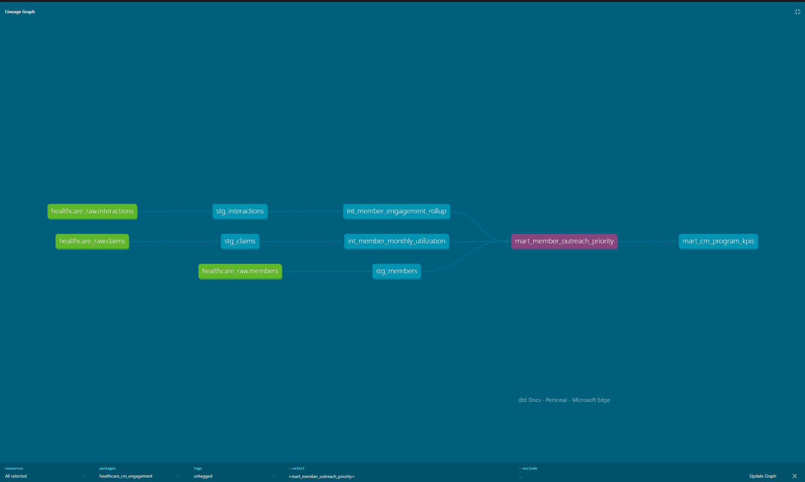

# Healthcare Care Management Engagement Pipeline (dbt)

## Overview
This project builds an end-to-end healthcare analytics pipeline designed to identify high-risk members for care management outreach.

Using dbt, raw healthcare data (claims, eligibility, interactions, care management episodes) is transformed into analytics-ready models to support outreach prioritization.

## Objective
Identify members who are:
- High cost
- High risk
- Not engaged in care management

## Tech Stack
- dbt (data modeling)
- Snowflake (data warehouse)
- Python / Pandas (EDA & validation)
- SQL (core transformations)

## Data Pipeline
- **Staging:** Clean raw data sources
- **Intermediate:** Aggregate utilization & engagement
- **Mart:** Final outreach prioritization model

## Key Model
`mart_member_outreach_priority`

Classifies members into:
- High Priority
- Medium Priority
- Low Priority

Based on:
- Risk level
- Engagement status
- Total healthcare cost
- Utilization patterns (IP, ER, OP, RX)

## Key Insights
- High Priority members have the highest cost per member
- High Priority members are not engaged in care management
- Majority of total spend comes from Low Priority members due to volume
- ER and inpatient utilization is higher among High Priority members

## Business Impact
Enables healthcare organizations to:
- Target high-risk members for intervention
- Improve care management engagement
- Reduce avoidable healthcare costs
- Balance population health vs targeted outreach strategies

## Repository Structure

models/
  staging/
  intermediate/
  marts/

notebooks/
  outreach_priority_analysis.ipynb

data/
  raw/
  exports/

## Data Lineage

